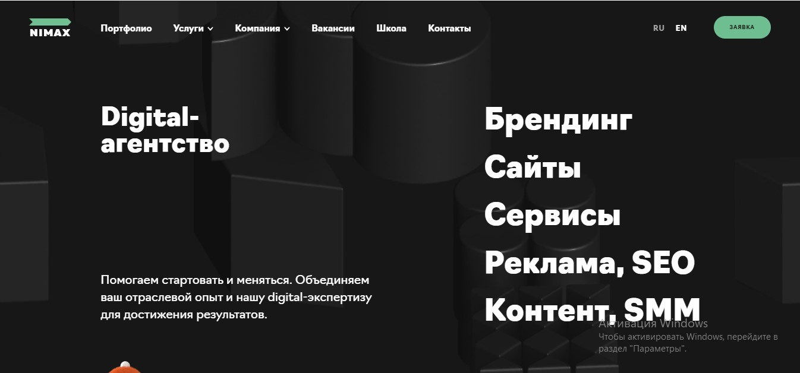

<!-- 1. ### Анализ сайтов и свойств -->
# АНАЛИЗ СОВРЕМЕННЫХ САЙТОВ
## ЛАБОРАТОРНАЯ РАБОТА №10 по дисциплине «Веб-технологии»
**Выполнил**: Студент группы 211-321 Бекмуратов Дилмурат Бекмуратович.

1. ### Анализ сайтов и свойствc
    1.1 Подборка сайтов:
    | № | Название сайта    | Краткое описание               |
    |---|-------------------|--------------------------------|
    |1. | [AGIMA](https://www.agima.ru/)    | AGIMA —     AGIMA —     крупнейший интегратор digital-решений. Один из лидеров в сфере веб-разработки и мобильной разработки по версии Тэглайн и Ruward. крупнейший интегратор digital-решений. Один из лидеров в сфере веб-разработки и мобильной разработки по версии Тэглайн и Ruward.  |
    |2. | [ADV](https://adv.ru/#Home)  |ADV / web-engineering co. является разработчиком и интегратором омниканальных онлайн-систем. Компания основана в 1997 году, имеет более 20 лет опыта разработки, внедрения и развития веб и мобильных решений для бизнеса.|
    |3.| [AWG](https://www.awg.ru/)| Компания AWG – digital-интегратор, специализирующийся на проектах по цифровой трансформации и построении омниканальных решений для крупных компаний из ритейла, финансовой сферы и страхования.|
    |4.|  [AIC + QSOFT](https://www.aic.ru/)|Альянс AIC+QSOFT — уникальный пример, когда две самодостаточные и успешные компании смогли договориться и предложить рынку качественный интегрированный продукт.|
    |5.| [АРТВЕЛЛ](https://www.artwell.ru/)|Компания «АРТВЕЛЛ» входит в топ крупнейших системных интеграторов|
    |6.| [Extyl](https://www.extyl-pro.ru/) | Работаем попроектно, по retainer или аутстаф-модели.Extyl состоит из четырех подразделений: — портальные решения: Интранеты/b2b/личные кабинеты;    — web: eCommerce, маркетплейсы. Любим писать API, шины данных и высокие нагрузки;— enterprise: сложные и большие ИТ-системы на PHP или Java, с обязательным проектированием, ПМИ и документацией;— mobile: нативные и гибридные, с AR/VR и без.|
    |7.| [Art. Lebedev Studio](https://www.artlebedev.ru/) | Основные направления — айдентика, создание сайтов и мобильных приложений, промышленный дизайн, городской дизайн, графический дизайн, дизайн среды, системы навигации, проектирование интерфейсов, создание шрифтов, дизайн паттернов, архитектура и книгоиздание.|
    |8.| [Red Collar](https://www.redcollar.ru/) | Лидеры по количеству международных наград в России: 100+ побед, в том числе золото на The Webby Awards, Red Dot Design Award и Агентство года на CSS Design Awards. Создаём впечатляющие цифровые вещи, которые помогают брендам проникать не только в умы, но и сердца людей.|
    | 9. | [Promo Interactive](https://www.promo.ru/) |Успешный опыт работы на рынке, накопленная экспертиза и взаимодействие с коллегами по Ogilvy Group позволяют предлагать клиентам следующий спектр услуг: разработка, аудит, оптимизация веб-сайтов и мобильных сайтов; создание интернет-магазинов; разработка и проведение рекламных кампаний; интернет-консалтинг, маркетинговые исследования; разработка креативных концепций; продвижение в digital-среде.|
    |10.| [nimax](https://www.nimax.ru/) | nimax — Nimax — стратегия и комплексное диджитал-обслуживание компаний, решения в области брендинга, веб-разработки и интернет-рекламы.|

    1.2 Свойства:
    | № |Синтаксис, значения, прочая информация|Назначение | Где встретилось |
    |---|--------------------------------------|-----------|-----------------|
    |1. | `white-space:[normal; nowrap; pre; pre-wrap; pre-line; break-spaces;pre-line]`|  Свойство white-space управляет тем, как обрабатываются пробельные символы внутри элемента.| [Art. Lebedev Studio](https://www.artlebedev.ru/)|
    |2. | `visibility:[visible; hidden; collapse;]`|  Свойство visibility скрывает или показывает элемент без изменения разметки документа. Также скрывает строки и столбцы.| [Art. Lebedev Studio](https://www.artlebedev.ru/)|
    |3. | `overflow-x: [visible, hidden, clip, scroll, auto]`|  Обработка переполнения элемента по горизонтали. | [AIC + QSOFT](https://www.aic.ru/)|
    |4. | `text-rendering: [auto, optimizeSpeed, optimizeLegibility, geometricPrecision][inherit; initial; revert; unset;]`|  Свойство text-renderingCSS предоставляет механизму рендеринга информацию о том, для чего следует оптимизировать рендеринг текста. | [AIC + QSOFT](https://www.aic.ru/)|
    | 5 | ` letter-spacing: [normal, <length>] ` | Определяет межбуквенное расстояние в тексте | [AIC + QSOFT](https://www.aic.ru/) | 
    | 6 | ` pointer-events: [auto;  none; stroke; fill;] ` | Свойство pointer-events CSS задает, при каких обстоятельствах (если таковые имеются) конкретный графический элемент может стать объектом событий указателя.| [AIC + QSOFT](https://www.aic.ru/) | 
    | 7 | ` writing-mode: [horizontal-tb;  vertical-lr; vertical-rl;] ` | Свойство writing-mode определяет, расположены ли строки текста горизонтально или вертикально, а также направление, в котором блокируется прогресс. При установке для всего документа он должен быть установлен в корневом элементе.| [AIC + QSOFT](https://www.aic.ru/) | 
    | 8 | ` outline: [solid;  dashed red; thick double] ` | Свойство outline  задает все свойства контура в одном объявлении.| [AIC + QSOFT](https://www.aic.ru/) |
    | 9 | ` content: [inherit;  inherit; revert; unset; normal; none;] ` | Свойство content заменяет элемент сгенерированным значением. Объекты, вставленные с использованием contentсвойства, являются анонимными заменяемыми элементами.| [Promo Interactive](https://www.promo.ru/) |
    | 10 | ` quotes: [none;  initial; "'" "'"; "„" "“" "‚" "‘"; "«" "»" "‹" "›"; ] ` | Свойство quotes задает, как браузер должен отображать кавычки, добавляемые с использованием значений open-quotesили close-quotesсвойства CSScontent.| [Promo Interactive](https://www.promo.ru/) |

1. ### Структура Сайта
    
    ### [nimax](https://www.nimax.ru/)
    Использована методология bem.
    

    **Header** - не зафиксирован в верхней части страницы. Внутри heder находятся 2 блока  и 2 ссылок : a с классом `header__logo`, div с классом `header__group_contacts` , nav с классом `header__group_nav` и а с классом `header__link`. Для блоков установлена максимальная ширина в 1400px. Блоки выставлены в одну строку за счет `display: flex;`. Логотип выстовлен по левому краю. 
    Блок header__group_nav выставлен по сентру  за счет margin. Блок `header__group_contacts` выставлен по правому краю за счет того, что для  элемента указан `margin-left: auto;`. nav с классом `header__group_nav` состоит из 6 элементов двое из них имеет скрытые под категории которые появляются при наведении. Это реальизовано за счет `position: absolute;`,  эти элементи обернуты в div внутри которой есть два div для сосnаяние hover.

    **main** - Вся страница разделина на 4 части heder, div который main, div с формой, div который footer. div  с класом app__flow указан как контейнер  для основной части сайта, не выравниванен по центру margin padding `0`. Первый блок hello, в котором в фон установлено видео, и текс про сайта. 
    Далее находится обычный  блок со списками , ссылками и картинкой.
    Далее блок с карточками (12-шт) карточки выставлены в строку за счет `display: flex;` заданный на блок. Карточки реализованы через тег `a` как ссылки  для карточек задана ширина и высота .
    Далее еще один блок (div)  тоже с background-image, текстом и со списками(оl; li).
    Следующий часть сайта где можно посмотеть видео при клике кнопки, button.

    **form**- Форма добавлена как одельный раздель form с классом "other". Состоит из двух  div: 
        1. Информационная часть
        2. Сама Форма. 
    оба дива выставлены в одну строку (` display: flex; `)
    каждуму div заданы `width: 50%`.

    **footer**- в место тега footer использован тег header с классом "app__footer" внутри два блока (div) с классом "footer__nav" и "footer__social" которые через flex вставлены в одну строку. Таким же образом ссылки внутри div тоже вставлены в одну строку через flex.
    
    **Выводы** Код читаем, понять не сложно. Используются HTML5 теги, такие как ` <header> `, ` <nav> `, ` <form> `, ` <ol>; <li>`. В основном использовались `
`, лишних  немного.

### Пошаговое описание для реализации секции/блока

#### Шапка сайта **[nimax](https://www.nimax.ru/)**

1. Добавляем в header с классом `header` , для которого устанавливаем `display: flex;` .

2.  Добавляем  ссылку ` а `, в которых будут находиться логотип `img` устанавливаем свойство ` display: flex; `, `align-items: center ;``justify-content: center;`
`flex-shrink: 0;`

3. Внутр ссылки добавляем `img` c шириной `width: 70px;`. 

4. Добавляем  блок навигации ` nav `, в которых будут находиться нужные нам элементы и устанавливаем свойство ` display: flex; `, также добавляем  `margin: 0 calc(var(--space-s)*-0.35);`
`padding-right: var(--space-s);`

5. В навигацию добавляем 4 сыллок `a` и 2 `div`, div  для выпадающих ссылок.

6. Выпадающие ссылки при наведение. В  `div` cо свойством disply: fiex, внутри которого есть дива --  `div "headr__name"`, 
Второй  `div  "header__children"` это выподающаи списки, которое появится при наведение `:hover`.

7. В блоке `div "headr__name"`добавим текст "Услуги" и `<svg>` стрелка.

8. Дальше в header добавляем блок `div` со свойством `display: flex;`.

9. В внутрь блока `div` добавим два `div` бока. Первый для смены языка., с двумя элемнтами. Второй блок для ссылки `a` который подбросить в форм.

### Список ресурсов
* [LearnJavaScript](https://learn.javascript.ru/) - Современный учебник JavaScript. Регулярно прохожу новые разделы.

* [Coursera](https://www.coursera.org/) - Онлайн - курсы. Записался на курс по вертске и  JavaScript.

* [Хабр](https://habr.com/ru/all/) - Веб-сайт в формате системы тематических коллективных блогов с элементами новостного сайта. Иногда читаю заинтересовавшие меня статьи.

* [htmlbook](http://htmlbook.ru/) - Справочник для веб-мастера. В случае возникновения вопроса по какому либо тегу или свойсту могу найти ответы.

* [Фрилансер по жизни](youtube.com/c/FreelancerLifeStyle) - Видео блог на ютуб. Подписан на канал.

* [BrainsCloud](https://www.youtube.com/channel/UCqGjCzCi5zG3RjJUA-ZDBkQ) - Видео блог на ютуб. Подписан на канал.

* [Владилен Минин](https://www.youtube.com/channel/UCg8ss4xW9jASrqWGP30jXiw) - Видео блог на ютуб. Подписан на канал.

* [True Figma](https://t.me/true_figma) - Текстовый блог с ссылками на полезные материалы. Подписан на телеграмм канал.

* [Веб-стандарты](https://t.me/webstandards_ru) - Текстовый блог с ссылками на полезные материалы. Подписан на телеграмм канал.

* [Frontend Raccoon](https://t.me/frontendraccoon) - Текстовый блог с ссылками на полезные материалы. Подписан на телеграмм канал.

